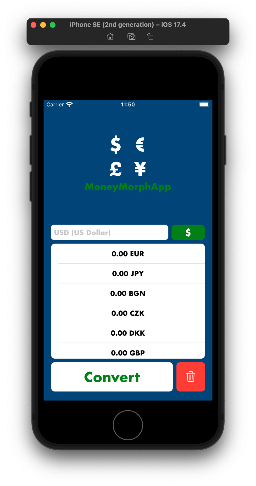
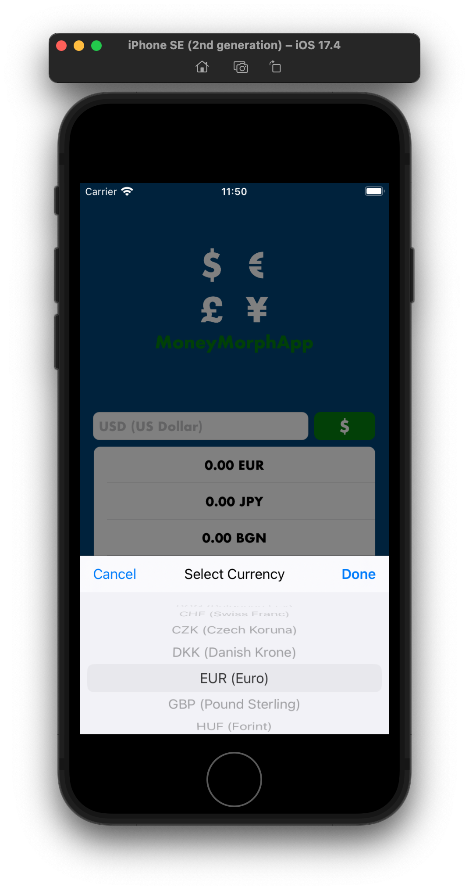

# MoneyMorphApp
MoneyMorphApp is an application designed for currency conversion tasks. This app allows users to convert amounts between different currencies and display the results in a user-friendly manner. I developed this project to enhance my skills in Objective-C programming.

### Objectives
- Strengthen proficiency in Objective-C programming language
- Gain practical experience in developing iOS applications using Objective-C
- Implement design patterns and architectural principles in Objective-C projects
- Improve code readability, maintainability, and efficiency in Objective-C codebases

## Screenshots
<div style="display: flex; justify-content: space-around;">
    
    
    
    
</div>

## Features
- Convert currency between different types.
- Present conversion results in a user-friendly format.
- User-friendly interface

## Getting Started
To get started with the project, follow these steps:
1. Clone the repository to your local machine:
```bash
git clone https://github.com/iammertozcan/MoneyMorphApp.git
```
2. Navigate to the project directory
```bash
cd MoneyMorphApp
```
3. Install the CocoaPods dependencies:
```bash
pod install
```   
4. Open the project in your preferred IDE (e.g., Xcode) using the `open MoneyMorphApp.xcworkspace` file.
5. Run the application and start using it to convert currencies!

## Usage
1. Enter the amount and select the currencies you want to convert between (e.g., USD to EUR, GBP to JPY).
2. Click the "Convert" button to see the conversion results.
3. The application will display the converted amount in other currencies.
4. To clear the screen, press the "Delete" button.

## Contributing
Contributions are welcome! If you'd like to contribute to this project, please follow the steps below:
1. Fork this repository (https://github.com/iammertozcan/MoneyMorphApp)
2. Create a new branch for your feature or bug fix:
```
git checkout -b feature/NewFeature
```
3. Commit your changes:
```
git commit -am 'Added a new feature'
```
4. Push your branch to your fork:
```
git push origin feature/NewFeature
```
5. Create a new Pull Request.

## Contact
If you have any questions or feedback, please reach out to us at [iammertozcan@gmail.com](mailto:iammertozcan@gmail.com).

## Dependencies
This project uses the CurrencyRequest pod for fetching and handling currency exchange rates and the ActionSheetPicker-3.0 to create customizable action sheet pickers. Ensure that you install the required pods by running pod install before opening the project in Xcode.

1. [CurrencyRequest](https://github.com/samkaufman/CurrencyRequest)
2. [ActionSheetPicker-3.0](https://cocoapods.org/pods/ActionSheetPicker-3.0)
